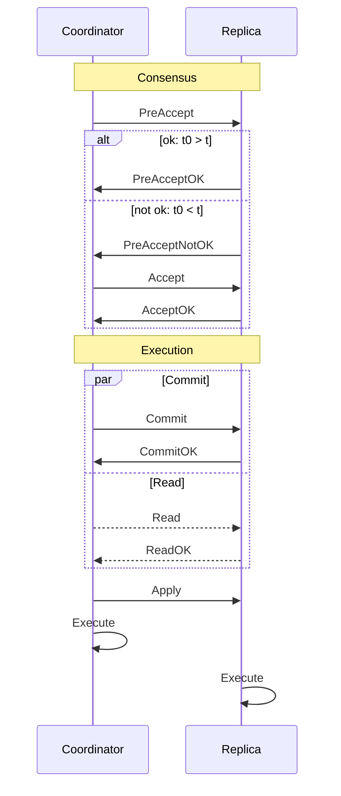
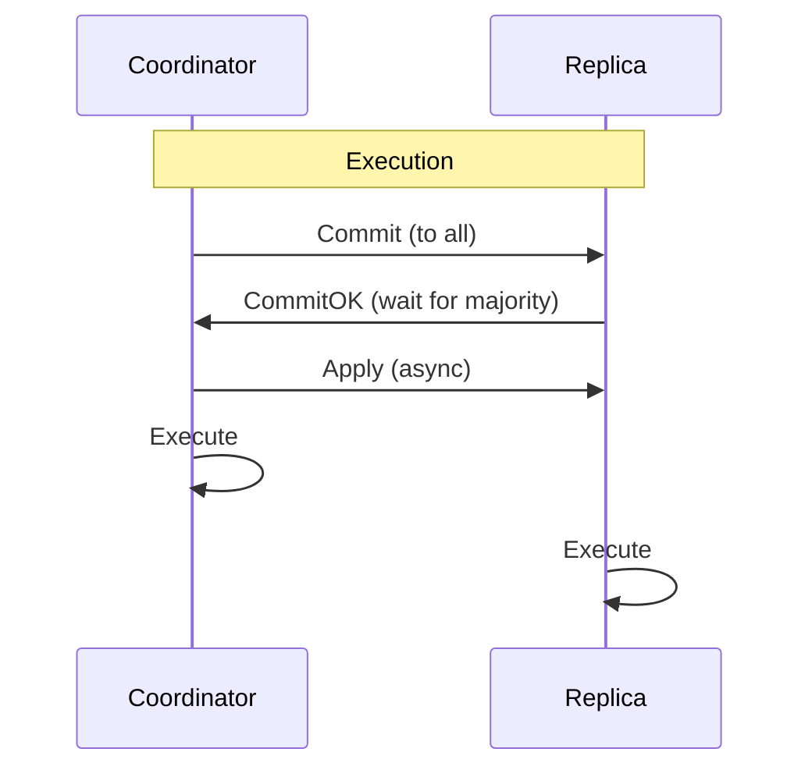

# Synevi architecture documentation

Synevi has multiple modules. The core modules are [consensus](../crates/consensus/) and [consensus_transport](../crates/consensus_transport/). While the transport crate defines the messages and services for data exchange between the coordinator and the replicas the consensus crate contains the main logic for consensus.

## Consensus algorithm

The consensus algorithm is based on Apache Cassandras [Accord](https://cwiki.apache.org/confluence/download/attachments/188744725/Accord.pdf?version=1&modificationDate=1630847737000&api=v2) consensus algorithm which is a leaderless concurrency optimized variant of EPaxos.

This original algorithm consists of four distinct phases:



Modified execution phase in Synevi:



1. PreAccept [PA]:

Send PreAccept (t0) to majority (all)

    Disaster cases:
    1. Crash before anyone notices request: -> Forget transaction
    2. Crash before majority notices request -> R-Recover(X, t0)
    3. Crash after majority notices request -> R-Recover(X, t0)

2. Accept (optional) [A]:

3. Commit [C]:

4. Applied

5. Recovery:

- Disaster PA:
    - 1 Forget transaction
    - 2 Recovery(X):
    ```
        if any !pre-accepted
            Continue state machine: Retry highest state machine step  
        else 
            Wait / Superceding 
    ```


### Consistency checking

Both the transaction as well as the execution result are hashed.
Together they create a signature that makes sure that all nodes came to the same execution result.
An applied transaction also contains the hash of the previous applied transaction, forming a hash-chain.

The execution of each transaction also creates an execution signature, this signature is not part of the transaction itself but 
allows replicas to detect storage failures or wrong preconditions and prevents them from accumulating a wrong state.
Updates of the execution logic might change this hash, so it is only valid at the time of execution under the condition that all replicas run the same execution logic.

### Dependencies & Reconfiguration

Add last applied event of coordinator to pre_accept to minimize dependency calculation and for
reconfiguration. If the last applied value of the coordinator gets sent, and this coordinator was
repeatedly in a minority of quorums, this prevents sending all applied dependencies of all other
replicas and can be used to sync nodes after crashing. This mechanism can also be integrated into 
a reconfiguration protocol to sync all nodes and added/removed members.

A reconfiguration protocol must then handle adding and removing members via consensus and
integrating a syncing step when all wait for applying the new member set.
